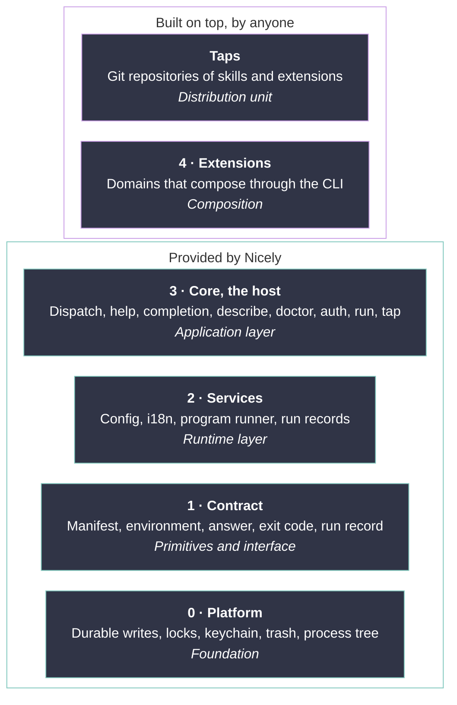

# Nicely architecture

This file says how Nicely is built: its layers, who owns each part, and where each domain lives.

## Core and extensions

Nicely is a small core, and everything it does for a user is an extension, in the spirit of Pi v1: a minimal host that is easy to extend and to compose.

- **Core** is the host: dispatch, help, completion, `describe`, `doctor`, `auth` with grants, `run`, and `tap`. It knows no domain.
- **Extensions** add domains, such as `transcript`. All of them share one manifest format and one contract, and they run with the rights of the user, because Nicely is not a sandbox. A **bundled** extension is compiled into `ncly`. Only what an agent needs to operate Nicely is bundled: `skill`, with the `nicely` skill. An **external** extension is an executable named `ncly-<domain>` beside its manifest. The first-party ones, such as `agent` and `transcript`, live in `extensions/` of this repository, and Pascal's personal tools, such as fleet sync, live in his private tap.

## Layers

The parts form a stack. Each box names its layer, what it holds, and, in italics, the design word for its role, as the [glossary](glossary.md#design-vocabulary) defines it.

- A layer depends only on the layers below it.
- Layers 0 to 2 that extensions need form the public SDK in `sdk/`, which core uses too. The keychain stays in core, and keys reach an extension only through grants.
- An extension reaches core through its environment and the CLI, and another extension only through the CLI, the same interface that agents use.
- Adding a domain never edits core.

Core says where a feature lives, not when it ships. The milestones decide timing.

## Code map

Each part has one owner: one package and one spec section.

| Layer | Part | Owns | Package | Spec |
|---|---|---|---|---|
| 4 | Each extension | Its domain's preparation, business steps, result verification, resume evidence, catalog, and skill | `extensions/<name>/` | Its `spec.md` |
| 3 | Extension host | Discovery, manifests, dispatch, answer checks, and grants | `internal/cli/` | [Extensions](contract.md#extensions) |
| 3 | Core commands | Help, completion, describe, doctor, auth, run, and tap | `internal/cli/` | [core-spec.md](core-spec.md) |
| 2 | Program runner | Child environment, timeouts, signals, and process cleanup | From M01 | [Programs that ncly runs](contract.md#programs-that-ncly-runs) |
| 2 | Record support | Run IDs, durable records, execution locks, and result publication | `sdk/`, from M10 | [Operations](contract.md#operations) |
| 2 | Config | Shared and local config files, environment, flags, and XDG paths | `internal/config/` | [Configuration](contract.md#configuration) |
| 2 | i18n | Catalogs in `locales/`, lookup, plurals, and number, size, and date formats | `internal/i18n/` | [Configuration](contract.md#configuration) |
| 2 | Interactive parts | The shared styles, forms, and screens | `internal/tui/` | [dev-preferences.md](dev-preferences.md#decide-the-look-with-a-published-mockup) |
| 1 | Contract | Answer, error registry, exit codes, modes, declarations, and streams | `internal/contract/` | [contract.md](contract.md) |
| 0 | Platform | Durable writes, locks, keychain, trash, and process tree | From M01; the keychain stays in core | [Record format](contract.md#record-format), [Keys](contract.md#keys) |

[M02](../milestones/M02-sdk.md) moves the shared packages that exist by then, the contract, i18n, config, tui, the platform helpers, and the program runner, from `internal/` to `sdk/`. A later shared service starts in `sdk/`, such as run records in M10. M00 fixed these responsibilities and the contract. Each implementation arrives with its first consumer: the host and the program runner in M01, the SDK in M02, and records with `ncly agent run` in M10.

The other folders:

- `cmd/ncly/`: the entry point, which wires core and the bundled extensions
- `internal/specdoc/`: reads the tables of the north-star docs for the tests that compare code and spec
- `testdata/script/`: testscript scenarios
- `tools/`: a separate module that pins the dev tools and holds the plan checker behind `just next` and `just test`

## Domains and commands

| Command | What it does | Kind | Milestone |
|---|---|---|---|
| `completion` | Prints shell completion scripts | core | M00 |
| `describe` | Describes installed commands and their capabilities | core | M04 |
| `doctor` | Checks tools, keys, extensions, and components | core | M05 |
| `auth` | Stores keys and grants them to extensions | core | M06, grants in M08 |
| `run` | Lists, inspects, and explicitly resumes recorded operations | core | M10, resume in M15 |
| `tap` | Adds and syncs repositories of skills and extensions | core | M12 |
| `skill` | Lists and views skills for agents, including the `nicely` skill | bundled | M03 |
| `agent` | Runs a task through a harness and a profile | external | M09 to M11 |
| `transcript` | Transcribes YouTube and Zoom audio, then summarizes it | external | M13 to M16 |
| `markdown`, `video`, `image` | Everyday tasks that need no configuration | external | M18 to M20, after the inventory of M17 |
| `docs` | Gathers project docs into one private site | external | M21 |

Core reserves the names of the core and bundled rows. `transcript` is not the first thing a visitor should try, because it needs a Deepgram key. First impressions come from the everyday domains.
